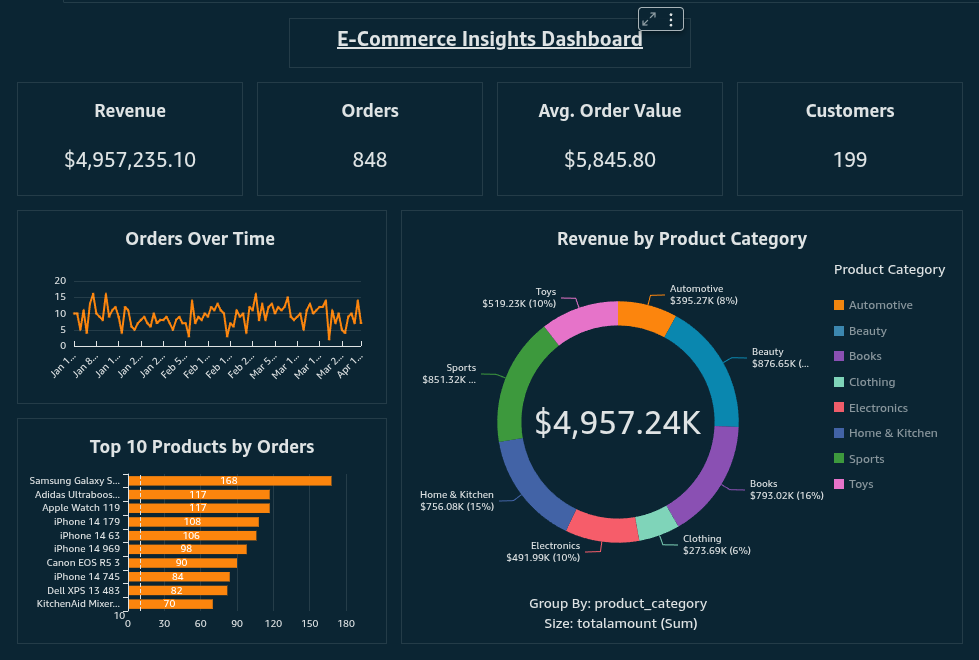

# Real-Time E-Commerce ETL Pipeline

A real-time, cloud-native ETL pipeline that ingests, processes, and visualizes e-commerce data from end to end — fully automated, fully scalable.


## Tech Stack

- **AWS Kinesis** – Real-time data ingestion
- **Amazon S3** – Raw and backup data storage
- **Apache Spark (PySpark)** – Data transformation
- **Amazon Redshift** – Data warehouse for analytics
- **Apache Airflow** – Workflow orchestration
- **Amazon QuickSight** – BI and dashboards
- **Terraform** – Infrastructure as code
- **GitHub Actions** – CI/CD for automated deployment

## Features

- Simulates realistic e-commerce transactions with sample data
- Real-time ingestion and batch processing capabilities
- Cleans, transforms, and enriches data using PySpark
- Automatically loads processed data into Redshift
- Enables reporting on customer behavior, sales trends, inventory, and promotions
- Includes monitoring and alerting with AWS CloudWatch

## Folder Structure

```bash
.
├── airflow/                    # Airflow setup
├── config/                     # Global/shared config
├── dashboards/                 # Dashboard screenshots
├── data_generation/            # Sample data generators
├── design/                     # ERD, Star Schema, Pipeline Architecture
├── docker/                     # Docker configs per service
├── jars/                       # Spark-Kinesis connector and Redshift-JDBC jars
├── redshift/                   # Redshift setup scripts
├── scripts/                    # Scripts for loading static data into S3 and Redshift, stream real-time data to Kinesis, and PySpark jobs and configs
├── tests/                      # Pytest unit/integration tests
├── tools/                      # Kinesis stream viewer 
├── .env                        # Environment variables
├── docker-compose.yml          # Main Docker setup
├── requirements.txt            # Global project dependencies
└── README.md                   # Project overview and instructions
```

## Sample Data

Run the provided script to generate fake but realistic data for:
- Customers, Orders, Products, Payments, Shipments, Promotions, Inventory, and more

```bash
python generate_sample_data.py
```

## Setup & Deployment

1. Clone the repo:

```bash
git clone https://github.com/amanuel496/real-time-ecommerce-etl-pipeline.git
cd real-time-ecommerce-etl-pipeline
```

2. Create and activate your virtual environment:

```bash
python -m venv venv
source venv/bin/activate
pip install -r requirements.txt
```

3. Provision AWS infrastructure (optional):

```bash
cd terraform
terraform init
terraform apply
```

4. Run the ETL pipeline locally, orchestrate with Airflow (Docker), or deploy to EMR.

## Dashboard Preview

This project includes an interactive real-time dashboard built using **Amazon QuickSight**, powered by data flowing through the ETL pipeline.

### Key Visuals:
- Total Revenue
- Total Orders
- Average Order Value
- Orders Over Time
- Top 10 Products by Orders
- Revenue by Product Category (Donut Chart)



The dashboard is refreshed from real-time data flowing into **Amazon Redshift Serverless** using Spark Structured Streaming and orchestrated with Airflow.

## Future Enhancements

- Integrate ML model for product recommendations
- Add user notification system using AWS SES

## License

MIT License. See `LICENSE` for more information.

---

Built by [@amanuel496](https://github.com/amanuel496)
